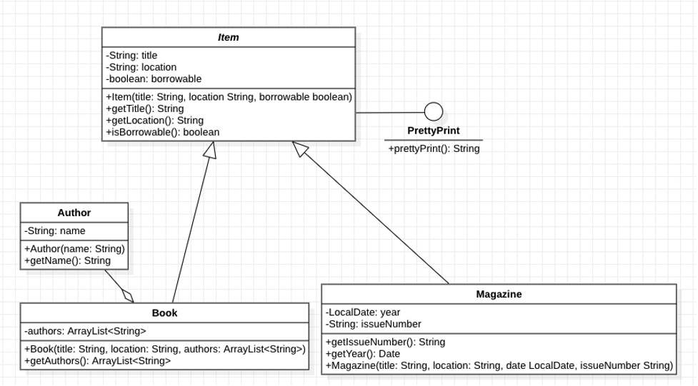

# Lab 7: UML and Object-Oriented Implementation  

**Due Date:** Mar 26, 2025, at 11:59 PM  

## Overview  

This lab will reinforce the use of UML (Unified Modeling Language) diagrams. Consider this: there are two choices for me to present requirements for assignments to you, the student:  

1. **Subjective:** Written descriptions where I list out what I would like, or  
2. **Objective:** A diagram that specifies almost perfectly what I would like  

Here is the UML diagram of what you need to implement. Do not worry—pages the later graphics visually demonstrate how to interpret the diagram. Imagine if I were to write this out — it would be obnoxious.  

Here is what I would like you to implement:  


---

## Instructions  

### 1. Project Setup  

- Use **VisualStudioCode** to complete this lab. Or whatever IDE you would like.  
- Ensure that your project follows this **package structure**:  

```Java
edu.canisius.csc213.lab7
```
- **Version Control**:  
- Create a **new private repository**.  
- Invite the instructor to the repository.  

### 2. Implementation Steps  

1. **Create the classes** listed in the UML diagram.  
2. **Implement a `main` method** in one of the classes (it does not matter which).  
 - Use the following code in the `main` method:  

  ```java
  public static void main(String[] args) {
     Author adichie = new Author("Chimamanda Ngozi Adichie");
     ArrayList<Author> authors = new ArrayList<>();
     authors.add(adichie);
     Item bookItem = new Book("Half of a Yellow Sun", "Third Floor", authors);
     LocalDate date = LocalDate.ofYearDay(2023, 1);
     Item magazineItem = new Magazine("Newsweek", "First Floor", date, "1");
     System.out.println("Created the objects!");
     System.out.println("You have to create the pretty print function!");
     // bookItem.prettyPrint();
     // magazineItem.prettyPrint();
  }
  ```

3. **Implement a `prettyPrint()` method** for both `Book` and `Magazine`.  
4. **Test the prettyPrint() output** by uncommenting the lines in the `main` method.  

### 3. Expected Output  

Your `prettyPrint()` method should format the output as follows:  

```bash
_______________________________________
| Type: Book                          | 
| Title: Half of a Yellow Sun         | 
| Can be borrowed: Yes                | 
| Author(s): Chimamanda Ngozi Adichie | 
| Location: Third Floor               |
_______________________________________

_________________________
| Type: Magazine        | 
| Title: Newsweek       | 
| Date: 2023            | 
| Issue: 1              | 
| Can be borrowed: No   | 
| Location: First Floor |
_________________________
```

---

## Submission Instructions  

1. **GitHub Repository**  
   - Commit and push your code to a **private Git repository**.  
   - Add your **instructor as a collaborator** to the repository.  

2. **D2L Submission**  
   - A **Dropbox has been created on D2L** where you must submit the **URL to your GitHub repository**.  

---

## Additional Resources  


If you are interested in learning more about UML, check out this tutorial: [UML.org](https://www.uml.org)  
